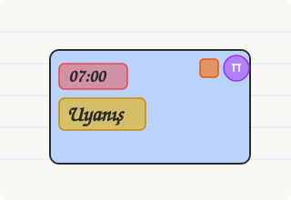

# 📝 Haftalık Tablom (Weekly Planner)

[**Türkçe**](#-türkçe) | [**English**](#-english)

---

## 🇹🇷 Türkçe

> **Kişisel planlarınızı not defteri estetiğinde, esnek saat modlarıyla ve 7 günlük interaktif çalışma alanıyla yönetin.**


### ✨ Öne Çıkan Özellikler

#### 🎨 1. Not Defteri Estetiği & El Yazısı Fontu (`Caveat`)
- Çizgili not defteri dokusu, organik çizim kart çerçeveleri ve dinamik renk temaları.
- Karanlık / Aydınlık mod desteği.

#### 🎯 2. Akıllı 5-Bölge Kart Tıklama Haritası



Aşağıdaki renk haritasında görüldüğü gibi her etkinlik kartı 5 farklı işlevsel bölgeye ayrılmıştır:
Her etkinlik kartı 5 farklı işlevsel bölgeye ayrılmıştır:
- 🔴 **Kırmızı Bölge (Saat Metni `07:00`)**: Tıklandığında esnek saat ve süre belirleme menüsü açılır (`07:00`, `07:00 / 07:10`, `08:30 - 09:15`, hazır süre çipleri, özel dakika).
- 🟡 **Sarı Bölge (İsim Metni)**: Tıklandığında doğrudan kart üzerinde inline isim düzenleme.
- 🔵 **Mavi Bölge (Kart Gövdesi & Boşluklar)**: Notlar, alt görevler (checklist), kaynak linkleri ve görsel eklerini içeren **Detay Penceresi** açılır.
- 🟠 **Turuncu Bölge (Tik Kutusu)**: Görevi tamamlandı olarak işaretler ve konfeti efekti tetikler.
- 🟣 **Mor Bölge (Çöp Kovası)**: Etkinliği silme onay diyaloğunu açar.

#### ⚙️ 3. 7 Günlük Varsayılan Plan Şablonu (Düzenleme Sahnesi)
- Tüm yeni haftalara ve sıfırlamalara yüklenen varsayılan programınızı 7 gün yan yana geniş bir tuval üzerinde düzenleyin.
- Fabrika ayarlarına sıfırlama veya şablonu mevcut aktif haftaya tek tıkla yükleme imkanı.

#### 🖨️ 4. Eksiksiz Poster Baskı & PDF Desteği (`@media print`)
- **"Poster Yazdır"** veya **"Detaylı Rapor"** butonlarıyla tüm planınızı not defteri çizgilerini ve el yazısı fontunu koruyarak eksiksiz, kesintisiz PDF/Baskı olarak çıkartın.

#### ⌨️ 5. Ctrl ile Otomatik Çoklu Seçim
- `Ctrl` (veya `Cmd`) tuşuna basılı tutarak kartın istediğiniz yerine tıklayın; tıklama menüleri engellenir ve kartlar otomatik olarak çoklu seçim moduna geçer (toplu silme, toplu tik atma, toplu renk değiştirme).

---

### 🚀 Hızlı Başlangıç

#### Standalone (Kurulumsuz Kullanım)
Depodaki `Haftalik_Planlayici.html` dosyasını bilgisayarınıza indirip çift tıklayarak tarayıcınızda doğrudan çalıştırabilirsiniz.

#### Geliştirici Kurulumu (Vite + React)

```bash
# Bağımlılıkları yükleyin
npm install

# Geliştirici sunucusunu başlatın
npm run dev

# Tek dosya HTML derlemesi alın
npm run build
```

---

## 🇬🇧 English

> **Manage your weekly schedules with a handwritten notebook aesthetic, flexible time formats, and an interactive 7-day planning canvas.**

### ✨ Key Features

#### 🎨 1. Notebook Aesthetics & Handwritten Typography (`Caveat`)
- Lined paper notebook texture, organic sketch borders, and dynamic color themes.
- Light and Dark mode toggle.

#### 🎯 2. Smart 5-Region Card Click Mapping


As shown in the color-coded reference diagram above, each task card is divided into 5 distinct functional regions:
Each task card is divided into 5 distinct functional regions:
- 🔴 **Red Region (Time Badge `07:00`)**: Opens the Quick Time & Duration Picker (`07:00`, `07:00 / 07:10`, `08:30 - 09:15`, preset duration chips, custom minutes).
- 🟡 **Yellow Region (Activity Title)**: Direct inline text editing directly on the card.
- 🔵 **Blue Region (Card Body & Background)**: Opens the **Detail Modal** (Notes, Checklists, Resource Links, Image Attachments).
- 🟠 **Orange Region (Checkbox)**: Toggles task completion with celebration confetti.
- 🟣 **Purple Region (Trash Can)**: Opens single task delete confirmation.

#### ⚙️ 3. 7-Day Default Plan Template Canvas
- A full-screen 7-column workspace canvas to edit default daily routines that automatically populate new weeks.
- One-click factory reset or apply template directly to the active week.

#### 🖨️ 4. Full Poster Print & PDF Export (`@media print`)
- Print or export as PDF (**Poster Print** or **Detailed Report**) preserving lined paper lines, handwritten fonts, and colorful borders without any slot truncation.

#### ⌨️ 5. Instant Ctrl Multi-Select
- Hold `Ctrl` (or `Cmd`) and click anywhere on any task card to automatically enter multi-select mode for bulk deletion, bulk completion, or bulk color changes.

---

### 🚀 Quick Start

#### Standalone Single-File Usage
Download `Haftalik_Planlayici.html` from the repo and double-click to run directly in any web browser without installation.

#### Developer Setup (Vite + React)

```bash
# Install dependencies
npm install

# Start development server
npm run dev

# Build standalone single-file HTML bundle
npm run build
```

---

## 📁 Project Structure

```
WeeklyPlanner/
├── Haftalik_Planlayici.html   # Standalone single-file production HTML app
├── src/
│   ├── components/            # React components (WeeklySchedule, SlotDetailModal, QuickTimePickerModal, DefaultPlanTemplateModal...)
│   ├── utils/                 # Local storage helpers
│   ├── index.css              # Notebook paper & print CSS rules
│   └── App.jsx                # Main application root
├── public/                    # Assets & icons
└── vite.config.js             # Vite singlefile bundler configuration
```

---

## 📝 License
MIT License - Free to use and customize.
